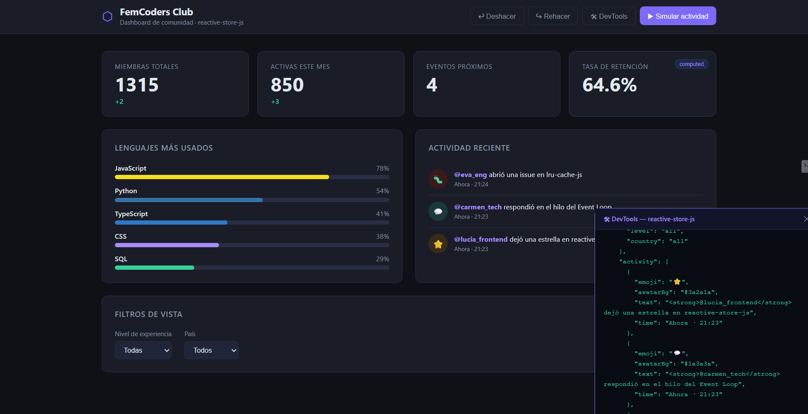
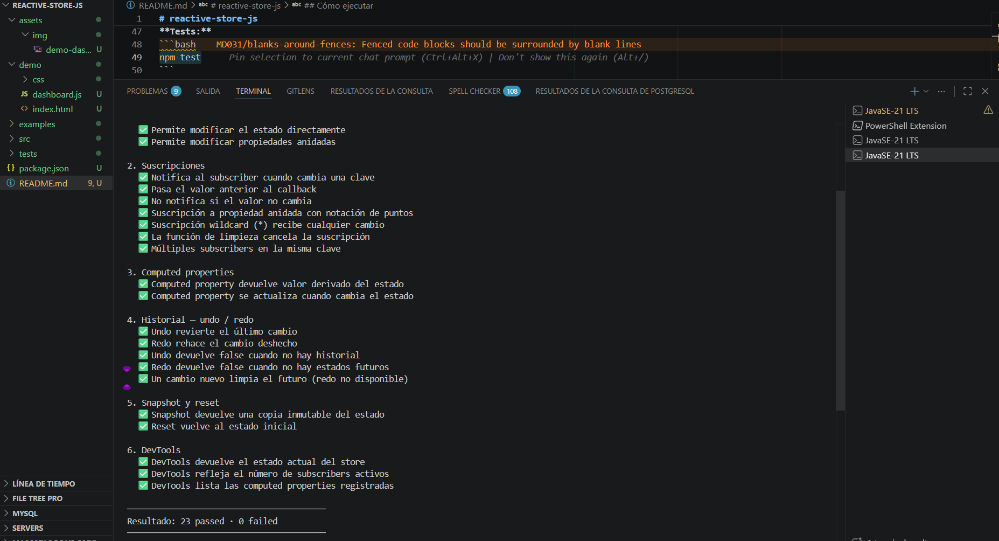
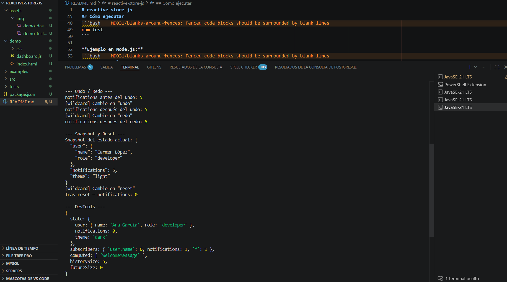

# reactive-store-js

Sistema de estado reactivo construido con `Proxy` nativo de JavaScript. Sin frameworks, sin dependencias externas. Vanilla JS puro.

Proyecto del Post 06 de la [Serie JavaScript de FemCoders Club](https://femcodersclub.com) — **Patrones de Diseño en JavaScript Puro**.

---

## Qué hace

`reactive-store-js` es una librería de gestión de estado que intercepta cada cambio mediante `Proxy` y notifica automáticamente a los suscriptores. La demo incluida es un dashboard de métricas de comunidad que demuestra la librería en acción.

**Características:**

- Suscripciones a claves concretas con notación de puntos (`'user.profile.name'`)
- Suscripción wildcard (`'*'`) para observar cualquier cambio
- Computed properties (valores derivados del estado)
- Historial de cambios con undo / redo (hasta 50 snapshots)
- Snapshots inmutables del estado
- DevTools integradas para debugging
- 23 tests con el módulo `assert` nativo de Node.js



---

## Estructura del proyecto

```
reactive-store-js/
├── src/
│   └── store.js          # Librería — el Proxy, el Observer, la API pública
├── demo/
│   ├── index.html        # Dashboard de métricas de comunidad
│   ├── dashboard.js      # UI conectada al store
│   └── css/
│       └── dashboard.css
├── tests/
│   └── store.test.js     # 23 tests con assert nativo
├── examples/
│   └── ejemplo-basico.js # Uso en Node.js
├── assets/
│   └── img/              # Capturas de pantalla
├── index.html            # Redirección a /demo/ para GitHub Pages
├── .nojekyll             # Desactiva Jekyll en GitHub Pages
└── package.json
```

---

## Cómo ejecutar

**Tests:**
```bash
npm test
```



**Ejemplo en Node.js:**
```bash
npm run example
```



**Dashboard (requiere un servidor local):**
```bash
npm run demo
# Abre http://localhost:3000/demo/
```

O con cualquier servidor estático apuntando a la raíz del proyecto.

---

## API

```js
// Crear un store
const store = createStore({ count: 0, user: { name: 'Ana' } });

// Leer y escribir estado
store.state.count = 5;
store.state.user.name = 'Lucía';

// Suscribirse a cambios
const unsubscribe = store.subscribe('user.name', (newVal, oldVal) => {
  console.log(`Cambio: ${oldVal} → ${newVal}`);
});

// Cancelar suscripción
unsubscribe();

// Computed property
const greeting = store.compute('greeting', (s) => `Hola, ${s.user.name}`);
console.log(greeting()); // "Hola, Lucía"

// Undo / Redo
store.undo();
store.redo();

// Snapshot inmutable
const snap = store.snapshot(); // copia profunda, no reactiva

// Reset al estado inicial
store.reset();

// DevTools
console.log(store.devtools());
```

---

## Patrones implementados

| Patrón | Dónde |
|---|---|
| **Observer** | `subscribe` / `notify` — los subscribers reaccionan a cambios de estado |
| **Proxy** | `createProxy` — intercepta lecturas y escrituras sin modificar el objeto original |
| **Memento** | `history` / `undo` / `redo` — historial de snapshots para deshacer cambios |

---

## Tests

```
1. Estado básico         4 tests
2. Suscripciones         7 tests
3. Computed properties   2 tests
4. Undo / Redo           5 tests
5. Snapshot y Reset      2 tests
6. DevTools              3 tests

Total: 23 passed · 0 failed
```

---

Proyecto de [FemCoders Club](https://femcodersclub.com) · Serie JavaScript · Post 06

---

## GitHub Pages

Para publicar el proyecto en GitHub Pages:

1. Ve a **Settings** → **Pages** en tu repositorio de GitHub
2. En **Source**, selecciona la rama `main` y carpeta `/ (root)`
3. Guarda los cambios
4. GitHub Pages construirá y publicará tu sitio en unos minutos
5. Accede a tu dashboard en: `https://femcodersclub.github.io/reactive-store-js/`

El `index.html` en la raíz redirige automáticamente a `/demo/` donde está el dashboard interactivo.
